# Almodiel Trucking Services ERD - Crow's Foot Notation

Source: `almodieltrucking.sql`

This diagram uses crow's foot notation through Mermaid `erDiagram` syntax. Each table shows its fields/columns. Relationships marked with `(logical)` are used by the application but are not enforced as foreign key constraints in the SQL dump.

Important: the system does not have a separate `trip` table. Trip records are grouped by `booking.tripID`, so tables with `tripID` connect logically to a booking trip group.

```mermaid
erDiagram
    LOCATION ||--o{ CUSTOMER : "locationID"
    LOCATION ||--o{ BOOKING : "pickupLocationID (logical)"
    LOCATION ||--o{ BOOKING : "destinationLocationID (logical)"

    CUSTOMER ||--o{ BOOKING : "customerID (logical)"
    CUSTOMER ||--o{ SALES : "customerID"
    CUSTOMER ||--o{ TARIFF : "customerID"

    EMPLOYEE ||--o{ BOOKING : "createdBy (logical)"
    EMPLOYEE ||--o{ DELIVERYCHARGE : "createdBy (logical)"
    EMPLOYEE ||--o{ EXPENSES : "createdBy"
    EMPLOYEE ||--o{ EXPENSES : "empID"
    EMPLOYEE ||--o{ INCIDENTREPORT : "driverID (logical)"
    EMPLOYEE ||--o{ INCIDENTREPORT : "reviewedBy (logical)"
    EMPLOYEE ||--o{ STAFFSALARY : "empID"
    EMPLOYEE ||--o{ STAFFSALARY : "createdBy"
    EMPLOYEE ||--o{ TRUCKEMPLOYEE : "empID"
    EMPLOYEE ||--o{ TRIPEMPLOYEE : "empID (logical)"
    EMPLOYEE ||--o{ TRUCKFUELLOG : "createdBy (logical)"

    BOOKING ||--o{ CARGO : "bookingID (logical)"
    BOOKING ||--o{ DELIVERYCHARGE : "bookingID (logical)"
    BOOKING ||--o{ SALES : "bookingID"
    BOOKING ||--o{ EXPENSES : "bookingID (logical)"
    BOOKING ||--o{ INCIDENTREPORT : "bookingID (logical)"
    BOOKING ||--o{ STAFFSALARY : "creditedBookingID"
    BOOKING ||--o{ DELIVERYCHARGE : "tripID group (logical)"
    BOOKING ||--o{ EXPENSES : "tripID group (logical)"
    BOOKING ||--o{ INCIDENTREPORT : "tripID group (logical)"
    BOOKING ||--o{ SALES : "tripID group (logical)"
    BOOKING ||--o{ STAFFSALARY : "tripID group (logical)"
    BOOKING ||--o{ TRIPEMPLOYEE : "tripID group (logical)"
    BOOKING ||--o{ TRUCKTRIPUSAGE : "tripID group (logical)"

    TRUCK ||--o{ EXPENSES : "truckID"
    TRUCK ||--o{ TRUCKEMPLOYEE : "truckID"
    TRUCK ||--o{ TRIPEMPLOYEE : "truckID (logical)"
    TRUCK ||--o{ TRUCKFUELLOG : "truckID (logical)"
    TRUCK ||--o{ TRUCKTRIPUSAGE : "truckID (logical)"

    BOOKING {
        int bookingID PK
        int customerID FK
        varchar storeName
        int pickupLocationID FK
        int destinationLocationID FK
        int tripID FK
        datetime pickupDateTime
        double price
        int createdBy FK
        datetime dateCreated
        varchar status
    }

    CARGO {
        int cargoID PK
        int bookingID FK
        varchar cargoType
        int quantity
        varchar condition
        text description
        text specialHandling
    }

    CUSTOMER {
        int id PK
        enum customerType
        varchar customerFName
        varchar customerLName
        varchar customerMI
        varchar contactPerson
        varchar email
        varchar phoneNumber
        varchar province
        double warehouseLatitude
        double warehouseLongitude
        varchar companyDocument
        varchar password
        date dateRegistered
        enum status
        int locationID FK
    }

    DELIVERYCHARGE {
        int deliveryChargeID PK
        int bookingID FK
        int tripID FK
        enum chargeType
        double amount
        text notes
        int createdBy FK
        datetime dateCreated
    }

    EMPLOYEE {
        int id PK
        varchar empFName
        varchar empLName
        varchar empMI
        varchar empSuffix
        date empBirthDate
        varchar empPhoneNumber
        varchar empEmail
        enum empType
        enum empStatus
        datetime dateCreated
        varchar empPassword
        varchar licenseNumber
        varchar licenseExpire
        varchar licenseImage
    }

    EXPENSES {
        int expenseID PK
        date expenseDate
        enum category
        double amount
        text description
        int truckID FK
        int empID FK
        int tripID FK
        int bookingID FK
        varchar referenceNo
        varchar receiptImage
        enum status
        int createdBy FK
        datetime dateCreated
    }

    INCIDENTREPORT {
        int incidentID PK
        int tripID FK
        int bookingID FK
        int driverID FK
        enum incidentType
        enum severity
        datetime incidentDateTime
        varchar locationText
        text description
        text actionTaken
        enum status
        text adminNotes
        int reviewedBy FK
        datetime dateSubmitted
        datetime dateUpdated
    }

    LOCATION {
        int locationID PK
        varchar province
        varchar city
        varchar barangay
        varchar street
        text description
        double latitude
        double longitude
    }

    SALES {
        int salesID PK
        int bookingID FK
        int tripID FK
        int customerID FK
        double grossAmount
        double expenseAmount
        double netAmount
        double paidAmount
        double balanceAmount
        varchar customerType
        varchar paymentStatus
        varchar salesStatus
        datetime dateGenerated
        datetime datePaid
        text remarks
    }

    STAFFSALARY {
        int salaryID PK
        int empID FK
        int tripID FK
        int creditedBookingID FK
        double creditedDistanceKm
        varchar tripRole
        date payPeriodStart
        date payPeriodEnd
        enum payType
        double baseRate
        double grossPay
        double deductions
        double netPay
        datetime datePaid
        enum status
        text remarks
        int createdBy FK
        datetime dateCreated
    }

    TARIFF {
        int tariffID PK
        int customerID FK
        varchar branch
        varchar origin
        varchar destination
        double distanceKm
        varchar truckType
        double baseRate
        tinyint hasFuelSubsidy
        double fuelRangeStart
        double fuelRangeEnd
        double fuelSubsidy
        enum status
        datetime dateCreated
    }

    TRIPEMPLOYEE {
        int tripEmployeeID PK
        int tripID FK
        int truckID FK
        int empID FK
        varchar role
        datetime dateCreated
    }

    TRUCK {
        int id PK
        varchar plateNumber
        varchar type
        double capacity
        int fuel
        int mileage
        varchar brand
        varchar corDocument
        varchar otherDocument
        varchar status
    }

    TRUCKEMPLOYEE {
        int truckEmployeeID PK
        int truckID FK
        int empID FK
        varchar role
        datetime dateCreated
    }

    TRUCKFUELLOG {
        int truckFuelLogID PK
        int truckID FK
        datetime logDate
        double litersAdded
        double fuelAfter
        double odometer
        double amount
        varchar station
        varchar referenceNo
        text notes
        int createdBy FK
        datetime dateCreated
    }

    TRUCKTRIPUSAGE {
        int truckTripUsageID PK
        int tripID FK
        int truckID FK
        double oneWayDistanceKm
        double roundTripDistanceKm
        double efficiencyKmPerLiter
        double fuelUsed
        double fuelBefore
        double fuelAfter
        double mileageBefore
        double mileageAfter
        datetime dateCreated
    }

    USERRIGHTS {
        int id PK
        varchar userid
        varchar empid
        varchar username
        varchar upassword
    }
```

## Reading The Diagram

- `||` means exactly one parent record.
- `o{` means zero or many child records.
- Example: `CUSTOMER ||--o{ BOOKING` means one customer can have many bookings.
- `(logical)` means the app uses that relationship, but the database dump does not enforce it with a foreign key.
- `USERRIGHTS` is shown as a standalone legacy table because it has no enforced relationship in the SQL dump.
