# Almodiel Trucking Services ERD

Source: `almodieltrucking.sql` and the current application models/views.

Full system documentation: [System-Documentation.md](System-Documentation.md)

MS Access-style view: [ERD-Access-Style.html](ERD-Access-Style.html)

Crow's foot notation view: [ERD-Crows-Foot.md](ERD-Crows-Foot.md)

Important note: the database does not have a separate `trip` table. A trip is represented by `booking.tripID`, which groups one or more booking rows together. Several tables reference `tripID` as a logical relationship, but these are not enforced as database foreign keys.

## Entity Relationship Diagram

```mermaid
erDiagram
    LOCATION ||--o{ CUSTOMER : "default address"
    LOCATION ||--o{ BOOKING : "pickup"
    LOCATION ||--o{ BOOKING : "destination"
    CUSTOMER ||--o{ BOOKING : "places"
    CUSTOMER ||--o{ SALES : "billed to"
    CUSTOMER ||--o{ TARIFF : "has rates"
    EMPLOYEE ||--o{ BOOKING : "creates"
    BOOKING ||--o{ CARGO : "contains"
    BOOKING ||--o{ DELIVERYCHARGE : "has charges"
    BOOKING ||--o{ SALES : "generates billing"
    BOOKING ||--o{ STAFFSALARY : "credits salary"
    BOOKING ||--o{ INCIDENTREPORT : "reported against"
    BOOKING ||--o{ EXPENSES : "linked expense"
    BOOKING ||--o{ TRIPEMPLOYEE : "trip crew group"
    BOOKING ||--o{ TRUCKTRIPUSAGE : "trip usage group"
    EMPLOYEE ||--o{ DELIVERYCHARGE : "creates"
    EMPLOYEE ||--o{ EXPENSES : "expense owner"
    EMPLOYEE ||--o{ EXPENSES : "created by"
    EMPLOYEE ||--o{ INCIDENTREPORT : "driver reports"
    EMPLOYEE ||--o{ INCIDENTREPORT : "admin reviews"
    EMPLOYEE ||--o{ STAFFSALARY : "earns"
    EMPLOYEE ||--o{ STAFFSALARY : "created by"
    EMPLOYEE ||--o{ TRUCKEMPLOYEE : "default crew"
    EMPLOYEE ||--o{ TRIPEMPLOYEE : "trip crew"
    EMPLOYEE ||--o{ TRUCKFUELLOG : "created by"
    TRUCK ||--o{ EXPENSES : "truck expense"
    TRUCK ||--o{ TRUCKEMPLOYEE : "default assignment"
    TRUCK ||--o{ TRIPEMPLOYEE : "assigned to trip"
    TRUCK ||--o{ TRUCKFUELLOG : "fuel log"
    TRUCK ||--o{ TRUCKTRIPUSAGE : "usage log"

    LOCATION {
        int locationID PK
        varchar location
        varchar locationType
        decimal latitude
        decimal longitude
        text address
        varchar status
    }

    CUSTOMER {
        int id PK
        int locationID FK
        varchar companyName
        varchar customerName
        varchar customerType
        varchar contactNo
        varchar email
        varchar status
    }

    BOOKING {
        int bookingID PK
        int tripID "logical trip group"
        int customerID FK
        int pickupLocationID FK
        int destinationLocationID FK
        int createdBy FK
        datetime pickupDateTime
        varchar hauling
        decimal price
        varchar status
    }

    CARGO {
        int id PK
        int bookingID FK
        varchar cargoName
        varchar quantity
        varchar description
    }

    DELIVERYCHARGE {
        int id PK
        int bookingID FK
        int tripID "logical trip group"
        int createdBy FK
        decimal chargeAmount
        varchar chargeType
        varchar status
    }

    SALES {
        int id PK
        int bookingID FK
        int tripID "logical trip group"
        int customerID FK
        decimal amount
        varchar paymentStatus
        date paymentDate
    }

    TARIFF {
        int id PK
        int customerID FK
        decimal fuelPumpPrice
        decimal rate
        varchar status
    }

    EMPLOYEE {
        int id PK
        varchar empid
        varchar fname
        varchar lname
        varchar role
        varchar status
        varchar username
        varchar password
    }

    TRUCK {
        int id PK
        varchar plateNo
        varchar truckType
        varchar truckName
        decimal currentMileage
        decimal currentFuel
        varchar status
    }

    TRUCKEMPLOYEE {
        int id PK
        int truckID FK
        int empID FK
        varchar role
        varchar status
    }

    TRIPEMPLOYEE {
        int id PK
        int tripID "logical trip group"
        int truckID FK
        int empID FK
        varchar role
        decimal salary
        decimal allowance
    }

    TRUCKFUELLOG {
        int id PK
        int truckID FK
        int createdBy FK
        varchar logType
        decimal fuelAmount
        decimal mileage
        text notes
        datetime createdAt
    }

    TRUCKTRIPUSAGE {
        int id PK
        int tripID "logical trip group"
        int truckID FK
        decimal startMileage
        decimal endMileage
        decimal fuelOut
        decimal fuelIn
        decimal estimatedDistance
        datetime completedAt
    }

    EXPENSES {
        int id PK
        int tripID "logical trip group"
        int bookingID FK
        int truckID FK
        int empID FK
        int createdBy FK
        varchar expenseType
        decimal amount
        decimal vatAmount
        text description
        date expenseDate
    }

    STAFFSALARY {
        int id PK
        int empID FK
        int tripID "logical trip group"
        int creditedBookingID FK
        int createdBy FK
        decimal salaryAmount
        decimal allowanceAmount
        varchar status
        date salaryDate
    }

    INCIDENTREPORT {
        int id PK
        int tripID "logical trip group"
        int bookingID FK
        int driverID FK
        int reviewedBy FK
        varchar incidentType
        varchar severity
        varchar status
        text description
        text actionTaken
        datetime incidentDateTime
    }

    USERRIGHTS {
        int id PK
        varchar empid "legacy employee code"
        varchar module
        tinyint canView
        tinyint canAdd
        tinyint canEdit
        tinyint canDelete
    }
```

## Explicit Foreign Keys In The SQL Dump

These relationships are enforced by database constraints:

- `customer.locationID` -> `location.locationID`
- `expenses.createdBy` -> `employee.id`
- `expenses.empID` -> `employee.id`
- `expenses.truckID` -> `truck.id`
- `sales.bookingID` -> `booking.bookingID`
- `sales.customerID` -> `customer.id`
- `staffsalary.createdBy` -> `employee.id`
- `staffsalary.creditedBookingID` -> `booking.bookingID`
- `staffsalary.empID` -> `employee.id`
- `tariff.customerID` -> `customer.id`
- `truckemployee.empID` -> `employee.id`
- `truckemployee.truckID` -> `truck.id`

## Logical Relationships Used By The App

These are used by the application but are not currently enforced by foreign key constraints in the dump:

- `booking.customerID` -> `customer.id`
- `booking.pickupLocationID` -> `location.locationID`
- `booking.destinationLocationID` -> `location.locationID`
- `booking.createdBy` -> `employee.id`
- `cargo.bookingID` -> `booking.bookingID`
- `deliverycharge.bookingID` -> `booking.bookingID`
- `deliverycharge.tripID` -> `booking.tripID`
- `deliverycharge.createdBy` -> `employee.id`
- `expenses.bookingID` -> `booking.bookingID`
- `expenses.tripID` -> `booking.tripID`
- `incidentreport.bookingID` -> `booking.bookingID`
- `incidentreport.tripID` -> `booking.tripID`
- `incidentreport.driverID` -> `employee.id`
- `incidentreport.reviewedBy` -> `employee.id`
- `sales.tripID` -> `booking.tripID`
- `staffsalary.tripID` -> `booking.tripID`
- `tripemployee.tripID` -> `booking.tripID`
- `tripemployee.truckID` -> `truck.id`
- `tripemployee.empID` -> `employee.id`
- `truckfuellog.truckID` -> `truck.id`
- `truckfuellog.createdBy` -> `employee.id`
- `trucktripusage.tripID` -> `booking.tripID`
- `trucktripusage.truckID` -> `truck.id`

## Documentation Notes

- `booking` is the central operations table.
- `tripID` is a grouping value, not a true parent table. If the system grows, creating a real `trip` table would make the schema easier to enforce and document.
- `truckemployee` stores default truck crew assignment.
- `tripemployee` stores crew assignment for a specific trip group.
- `truckfuellog` records fuel and mileage log entries.
- `trucktripusage` records trip completion usage, including mileage and fuel in/out.
- `staffsalary` records salary/allowance entries generated from completed trips.
- `userrights.empid` appears to use the employee code instead of `employee.id`, so it is treated as a legacy or loose relationship.
